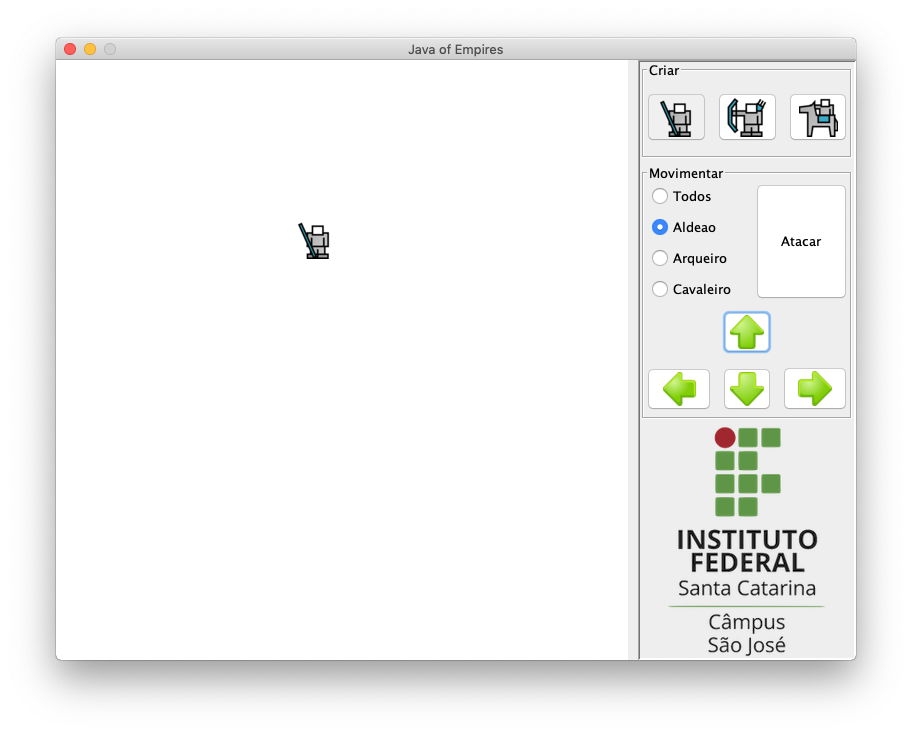

 

#  Java of Empires

Esqueleto de um projeto feito com IntelliJ IDEA 2018.2 para praticar os conceitos de herança, classe abstrata, interface e polimorfismo em Java. Nesse projeto só fora fornecida a implementação da classe Aldeão, contudo é necessário fazer:

- Implementar classes para representar Arqueiro e Cavaleiro
- Estudar o código e propor uma nova solução (terá que modificar a organização do código atual) que faça uso dos conceitos de Herança e Polimorfismo

Como resultado final, espera-se que o usuário possa:

- Criar Aldeão, Cavaleiro ou Arqueiro sempre que clicar nos respectivos botões
- Movimentar (cima, baixo, direita ou esquerda) somente os objetos do tipo Aldeão, somente objetos do tipo Cavaleiro, somente objetos do tipo Arqueiro ou todos os objetos, independente do tipo
- Fazer com que todos os objetos do tipo Aldeão ataquem
- Fazer com que todos os objetos do tipo Cavaleiro ataquem
- Fazer com que todos os objetos do tipo Arqueiro ataquem
- Fazer com que todos os objetos, independente do tipo, ataquem

**Nota:** Projeto desenvolvido com IntelliJ IDEA 2018.2 e JDK 11 